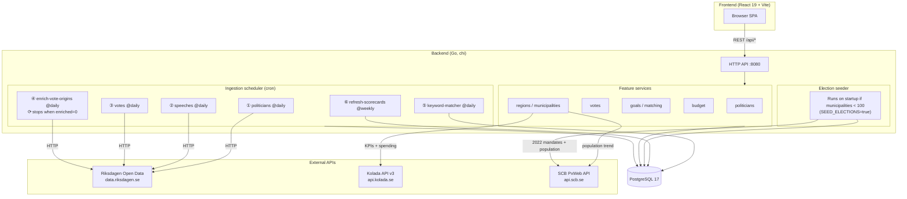

# Riksdagskollen

A civic tech tool that tracks Swedish politicians' stated promises and party goals against their actual voting records in Riksdagen (the Swedish parliament).

**Core value proposition:** Show the gap between what politicians *say* and what they *do* — with full context on who initiated each vote, so a NEJ vote on a healthcare bill is never misread as anti-healthcare.

**Live:** [sdt.runevibe.se](https://sdt.runevibe.se)

---

## Architecture



---

## Stack

| Layer | Tech |
|---|---|
| Frontend | React 19, Vite 6, TypeScript 5, Tailwind CSS v4, TanStack Query v5 |
| Backend | Go 1.26, chi router, pgx/v5, golang-migrate |
| Database | PostgreSQL 17 |
| Infra | Docker, Kubernetes (k3s), Helm, ArgoCD |
| Data sources | Riksdagen Open Data, Kolada API v3, SCB PxWeb API |

```bash
make run   # starts postgres + backend + frontend via docker compose
```

---

## The Problem

Swedish political accountability is hard for citizens to verify:

- Party manifestos and individual speeches contain hundreds of stated commitments
- Voting records are public but buried in Riksdagen's data systems
- A party voting NEJ on a healthcare proposal doesn't mean they oppose healthcare — the proposal may have been written by an opposing party with unacceptable attached conditions
- No existing tool cross-references promises with votes *and* shows who originated the proposal

---

## What It Should Do

### Two core views

**Party Goals View**
- Extract goals from party manifestos (valmanifest) and coalition agreements (Tidöavtalet)
- Match each goal against collective party voting behavior
- Show alignment percentage per goal, per topic
- Every vote displays: who proposed it, what type (government bill or party motion), and context for why a party may have voted against something superficially aligned with their goal

**Individual Politician View**
- Extract concrete promises from debate speeches (anföranden)
- Cross-reference with the politician's personal voting record
- Flag contradictions with explanation and proposal context

### Critical UX requirement

Every vote displayed **must** show:
- **Who initiated the proposal** — which party or the government
- **Proposal type** — Proposition (government bill) vs Motion (party initiative)
- **Context note** — brief explanation of why a party may have voted against something that looks aligned with their stated goal

---

## Data Source: Riksdagen Open API

Base URL: `https://data.riksdagen.se`  
Format: JSON. No authentication required. Cite "Sveriges riksdag" as source.

### Key endpoints

| Data | Endpoint |
|---|---|
| Members (ledamöter) | `GET /personlista/?rdlstatus=tjanstgorande&parti={party}&utformat=json` |
| Speeches (anföranden) | `GET /anforandelista/?rm=2024/25&iid={id}&utformat=json` |
| Votes (voteringar) | `GET /voteringlista/?rm=2024/25&iid={id}&utformat=json` |
| Document detail | `GET /dokumentstatus/{dok_id}.json` |
| Document search | `GET /dokumentlista/?doktyp=prop&utformat=json` |

**`intressent_id`** is the stable unique ID for a politician used across all endpoints.

### Tracing vote origin (critical)

To find who proposed what a party voted on:
1. Take the vote's `beteckning` (e.g., `SoU12`) and construct `dok_id`: `{rm_without_slash}:{beteckning}` → `202425:SoU12`
2. Fetch `/dokumentstatus/{dok_id}.json`
3. Inspect `dokreferens.referens[]`:
   - `ref_dok_typ=prop` → government proposition → `proposed_by = "Regeringen"`
   - `ref_dok_typ=mot` → party motion → fetch that motion's `dokumentstatus` → read `dokintressent[0].partibet` for the proposing party

### Riksdagen committees (beteckning prefixes)

| Prefix | Committee | Topics |
|---|---|---|
| SoU | Socialutskottet | Healthcare, elderly care |
| FöU | Försvarsutskottet | Defense, NATO |
| SfU | Socialförsäkringsutskottet | Migration, social insurance |
| SkU | Skatteutskottet | Taxes |
| FiU | Finansutskottet | Budget, finance |
| UbU | Utbildningsutskottet | Education |
| MJU | Miljö- och jordbruksutskottet | Climate, environment |
| NU | Näringsutskottet | Energy, business |
| JuU | Justitieutskottet | Crime, police, justice |
| CU | Civilutskottet | Housing |
| AU | Arbetsmarknadsutskottet | Labor market |
| TU | Trafikutskottet | Transport |
| KU | Konstitutionsutskottet | Constitutional matters |
| UU | Utrikesutskottet | Foreign affairs |

---

## Domain Model

### Core entities

**Politician** — a Riksdagen member identified by `intressent_id`. Has party, constituency, active status.

**Speech (anförande)** — a debate contribution. Contains the raw text from which promises are extracted.

**Vote** — a single politician's vote on a specific proposal point (`beteckning` + `forslagspunkt`). Result is Ja, Nej, Avstår, or Frånvarande. Enriched with who proposed it and what type.

**Party Goal** — an extracted commitment from a party manifesto or coalition agreement. Has topic, specificity (concrete / directional / rhetorical), source document, and keywords for matching.

**Promise** — an extracted commitment from an individual speech. Same structure as a goal but tied to a specific politician and speech.

**Goal–Vote Match** — a scored link between a party goal and a vote. Records relevance score, which vote direction aligns with the goal, and a context note explaining political nuance.

**Promise–Vote Match** — same for individual promises. Records whether the vote supports, contradicts, or is unclear against the promise.

### Scoring

Alignment is not binary. A party voting NEJ can still be aligned with a goal if:
- The proposal came from an opposing party with unacceptable attached conditions
- The proposal was a tactical opposition motion the party chose not to endorse for procedural reasons

The `context_note` field exists on every match specifically to capture this nuance. It should be generated (or curated) per match, not inferred from the vote result alone.

---

## Database Structure

PostgreSQL 17. All migrations in `backend/migrations/` (numbered `000001`–`000011`). Run automatically on backend startup.

### Tables

| Table | What it holds | Source | Updated |
|---|---|---|---|
| `politicians` | Riksdag MPs — name, party, constituency, active status | Riksdagen Open API | Daily cron |
| `speeches` | Debate contributions (anföranden) — raw text, date, politician | Riksdagen Open API | Daily cron |
| `votes` | Individual votes per MP per proposal point — result, beteckning, enriched origin | Riksdagen Open API | Daily cron |
| `ingestion_cursors` | Watermark per data type (last fetched date/id) | Internal | Each sync |
| `party_goals` | Goals extracted from manifestos and Tidöavtalet — topic, specificity, keywords | SQL seed (migration 003) | Manual |
| `promises` | Commitments extracted by AI from speeches — topic, keywords | AI worker | As speeches arrive |
| `goal_vote_matches` | Relevance links between a party goal and a vote — score, aligned direction, context note | AI matching job | Weekly |
| `promise_vote_matches` | Relevance links between a promise and a vote | AI matching job | Weekly |
| `expenditure_areas` | The 27 fixed Swedish budget categories (UO1–UO27) | SQL seed (migration 004) | Static |
| `budget_years` | One row per budget year + status (decided / proposed) | SQL seed (migrations 005–009) | Manual |
| `budget_allocations` | Allocation per expenditure area per year, in KSEK | SQL seed (migrations 005–009) | Manual |
| `economic_indicators` | KPI time series for regions and municipalities | Kolada + SCB APIs | On request, cached |
| `regions` | 21 Swedish regions — population, governing parties, 2022 election results | SQL seed (migration 011) | Manual |
| `municipalities` | 290 Swedish kommuner — population, governing parties, 2022 election results | SQL seed (migration 011) | Manual |
| `regional_election_results` | Per-party mandates and vote share per region, 2022 | SQL seed (migration 011) | Manual |
| `municipal_election_results` | Per-party mandates and vote share per municipality, 2022 | SQL seed (migration 011) | Manual |
| `party_scorecards` | Materialized view — per-party alignment % per goal across all matching votes | Derived from above | Refreshed weekly |

### What lives outside the database

These are **fetched at request time** (with in-process cache) and never persisted to Postgres:

| Data | Source | Cache |
|---|---|---|
| Government agency (myndighet) expenditure & budget history | Statskontoret årsutfall ZIP/CSV | 24 h in-process |
| Government agency headcount history | SCB KLS API (AM0102) | 24 h in-process |
| Regleringsbrev links | Riksdagen document search API | None (URL template) |

### Adding new migrations

```bash
# Create a new migration pair
migrate create -ext sql -dir backend/migrations -seq description_here
# Then edit the generated .up.sql / .down.sql files
# Migrations run automatically on next backend startup
```

---

## AI Layer

Three AI tasks:

1. **Extract promises from speeches** — given a speech text, return structured promises with topic, specificity, and keywords
2. **Extract goals from party documents** — same structure but from manifesto text; also return relevant committee codes
3. **Score vote relevance to a goal/promise** — given a goal and a vote (including who proposed it), return relevance score, aligned direction, and a Swedish-language context note

The AI layer should be abstracted behind an interface so any LLM (Claude, GPT, local model) can be plugged in.

---

## API Shape

```
GET /api/parties                              list all parties with summary alignment scores
GET /api/parties/{party}/goals                party goals with alignment data, filterable by topic
GET /api/parties/{party}/goals/{id}/votes     vote breakdown for a specific goal

GET /api/politicians                          paginated list with summary stats
GET /api/politicians/{id}                     full profile
GET /api/politicians/{id}/promises            promises with vote matches
GET /api/politicians/{id}/votes               voting record with proposal origin

GET /api/votes/{beteckning}/{punkt}           full vote detail with all-party breakdown

GET /api/budget/years                         available budget years
GET /api/budget/years/{year}                  full budget breakdown
GET /api/budget/years/{year}/compare/{year}   side-by-side delta comparison
GET /api/budget/areas                         all 27 expenditure areas
GET /api/budget/areas/{code}                  time series for one area
```

---

## Design Principles

- **Read-only public API** — no authentication needed for the civic data
- **Proposal origin on every vote** — never show a vote result without context of who proposed it
- **Keyword matching as fallback** — when AI scoring is unavailable, keyword overlap between goal/promise and vote document title provides a baseline
- **Incremental data sync** — daily pull from Riksdagen API; only fetch new data since last run
- **Budget in KSEK as integers** — avoid float precision issues for large monetary amounts

---

## Existing Projects (for reference)

- [github.com/OAndell/Riksdagskollen](https://github.com/OAndell/Riksdagskollen) — Android app using the same API
- [hack23.com/cia](https://hack23.com/cia) — Citizen Intelligence Agency, tracks politician metrics
- [github.com/welfare-state-analytics/riksdagen-corpus](https://github.com/welfare-state-analytics/riksdagen-corpus) — full historical corpus

None of these do promise-to-vote cross-referencing with proposal origin context. That is the differentiator.
